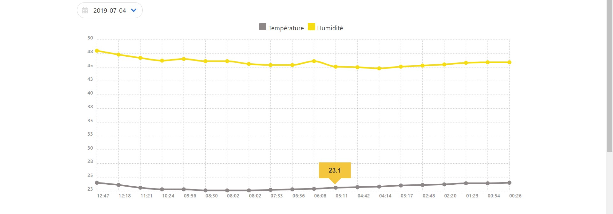

# GraphiqueArduino
Chartist.js, API, JS

Création d'un graphique de température/humidité pour le suivi des températures jour par jour. Données issue d'un fichier json. Librairie JS pour les graphiques : Chartist.js

Rendu : 

